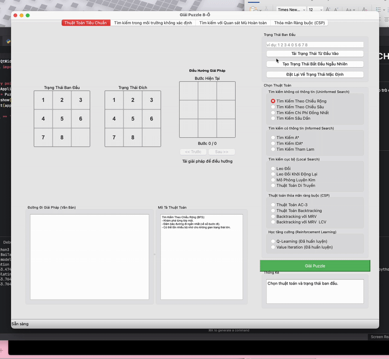
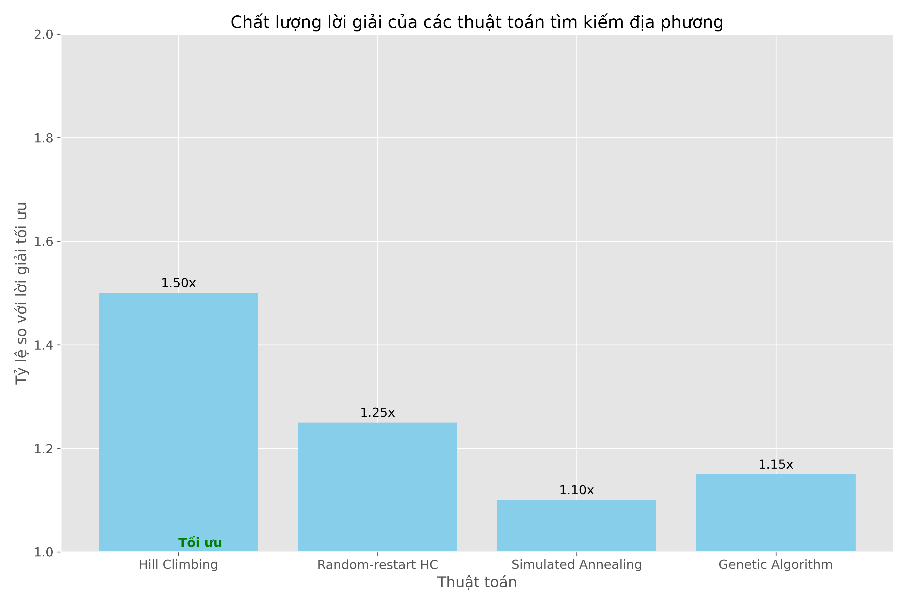

# GIẢI THUẬT TÌM KIẾM VÀ ỨNG DỤNG TRONG TRÒ CHƠI 8-PUZZLE

## 1. Mục tiêu
Dự án này tập trung vào việc cài đặt và so sánh hiệu suất của các giải thuật tìm kiếm khác nhau khi áp dụng vào trò chơi 8-ô chữ (8-puzzle). Mục tiêu chính bao gồm:
- Nghiên cứu và triển khai các thuật toán tìm kiếm không thông tin và có thông tin
- Phân tích hiệu suất của từng thuật toán
- Xây dựng giao diện trực quan để minh họa quá trình tìm kiếm
- So sánh ưu nhược điểm của các thuật toán trong bài toán cụ thể



## 2. Nội dung

### 2.1. Các thuật toán Tìm kiếm không có thông tin

#### Thành phần chính của bài toán tìm kiếm
- **Trạng thái**: Cấu hình của bảng 8-puzzle (ma trận 3x3)
- **Trạng thái ban đầu**: Cấu hình bắt đầu của bảng
- **Trạng thái đích**: Cấu hình mục tiêu cần đạt được `[[1,2,3],[4,5,6],[7,8,0]]`
- **Hàm kế thừa (successor function)**: Các thao tác di chuyển ô trống (lên, xuống, trái, phải)
- **Lời giải**: Chuỗi các hành động để đi từ trạng thái ban đầu đến trạng thái đích


#### So sánh hiệu suất


#### Nhận xét
- BFS đảm bảo tìm ra lời giải tối ưu nhưng tốn nhiều bộ nhớ
- DFS tốn ít bộ nhớ nhưng không đảm bảo tìm ra lời giải tối ưu, có thể rơi vào vòng lặp vô hạn
- UCS đảm bảo tìm ra lời giải tối ưu nhưng tốn nhiều thời gian và bộ nhớ
- IDS kết hợp ưu điểm của BFS và DFS, đảm bảo tìm ra lời giải tối ưu với chi phí bộ nhớ thấp

### 2.2. Các thuật toán Tìm kiếm có thông tin

#### Thành phần bổ sung
- **Hàm heuristic**: Ước lượng chi phí từ trạng thái hiện tại đến trạng thái đích
  - **Manhattan Distance**: Tổng khoảng cách theo chiều ngang và dọc từ vị trí hiện tại của ô đến vị trí đích
  - **Hamming Distance**: Số ô không đúng vị trí


#### So sánh hiệu suất


#### Nhận xét
- Greedy Best-First Search nhanh nhưng không đảm bảo tìm ra lời giải tối ưu
- A* đảm bảo tìm ra lời giải tối ưu nếu hàm heuristic là admissible (không đánh giá quá cao)
- IDA* kết hợp A* với tìm kiếm theo chiều sâu, giúp giảm bộ nhớ sử dụng
- Hàm heuristic có ảnh hưởng lớn đến hiệu suất, với Manhattan > Hamming

### 2.3. Các thuật toán Tìm kiếm địa phương (Local Search)

#### Thành phần chính
- **Trạng thái**: Giống như các thuật toán khác
- **Hàm đánh giá (evaluation function)**: Đánh giá chất lượng của trạng thái hiện tại
- **Chiến lược chọn lựa hàng xóm**: Cách lựa chọn trạng thái kế tiếp từ các trạng thái lân cận

#### Các thuật toán chính
1. **Hill Climbing**
   - Luôn chọn trạng thái kế tiếp tốt nhất từ các trạng thái lân cận
   - Dễ bị mắc kẹt ở cực tiểu cục bộ

2. **Random-restart Hill Climbing**
   - Chạy Hill Climbing nhiều lần từ các điểm xuất phát ngẫu nhiên
   - Tăng khả năng tìm thấy lời giải tốt hơn

3. **Simulated Annealing**
   - Cho phép đôi khi chọn trạng thái kém hơn để thoát khỏi cực tiểu cục bộ
   - Xác suất chọn trạng thái kém hơn giảm dần theo thời gian (lịch làm lạnh)

4. **Genetic Algorithm**
   - Mô phỏng quá trình tiến hóa tự nhiên
   - Duy trì một quần thể các lời giải, kết hợp (crossover) và đột biến (mutation)

#### So sánh hiệu suất





#### Nhận xét
- Hill Climbing nhanh nhưng dễ bị mắc kẹt ở cực tiểu cục bộ
- Random-restart Hill Climbing cải thiện tỷ lệ thành công nhưng tăng thời gian thực thi
- Simulated Annealing cân bằng giữa khám phá không gian trạng thái và tối ưu hóa
- Genetic Algorithm có tỷ lệ thành công cao với các bài toán phức tạp nhưng chậm hơn

### 2.4. Tìm kiếm trong môi trường phức tạp

#### AND-OR Graph Search
- Giải quyết bài toán trong môi trường không xác định
- Tạo ra kế hoạch có điều kiện (contingency plan)
- Xử lý được các trường hợp khi kết quả hành động không chắc chắn

#### Mô hình hóa môi trường không xác định cho 8-puzzle
- Giả định rằng khi di chuyển ô trống có một xác suất nhỏ (p_slip) để trượt sang hướng khác
- Mỗi hành động có thể dẫn đến nhiều trạng thái kết quả khác nhau

#### So sánh hiệu suất


#### Nhận xét
- AND-OR Graph Search tạo ra kế hoạch mạnh mẽ hơn đối với môi trường không xác định
- Độ phức tạp của kế hoạch tăng nhanh khi xác suất trượt (p_slip) tăng
- Kế hoạch có điều kiện có khả năng phục hồi cao khi gặp kết quả không mong đợi
- Chi phí bộ nhớ và thời gian cao hơn các thuật toán thông thường

### 2.5. Các thuật toán Học tăng cường (Reinforcement Learning)

#### Thành phần chính
- **Trạng thái (S)**: Cấu hình của bảng 8-puzzle
- **Hành động (A)**: Các nước đi hợp lệ
- **Phần thưởng (R)**: Thường là âm cho mỗi bước đi, dương lớn khi đạt đích
- **Chính sách (π)**: Ánh xạ từ trạng thái đến hành động

#### Các thuật toán chính
1. **Q-Learning**
   - Học không dựa trên mô hình
   - Xây dựng bảng Q(s,a) để đánh giá giá trị của cặp (trạng thái, hành động)

2. **Value Iteration**
   - Học dựa trên mô hình
   - Tính toán giá trị tối ưu của mỗi trạng thái

3. **SARSA**
   - Học không dựa trên mô hình, on-policy
   - Cập nhật dựa trên hành động thực tế được chọn

4. **Deep Q-Networks (DQN)**
   - Sử dụng mạng nơ-ron để ước lượng hàm Q
   - Thích hợp cho không gian trạng thái lớn

#### So sánh hiệu suất


#### Nhận xét
- Các thuật toán học tăng cường có thể tự động học chiến lược tối ưu qua thời gian
- Cần thời gian huấn luyện dài nhưng thực thi nhanh sau khi học xong
- Q-Learning và Value Iteration hiệu quả cho 8-puzzle cỡ nhỏ và trung bình
- DQN có khả năng mở rộng tốt hơn cho không gian trạng thái lớn (4x4 puzzle)
- Cân bằng giữa khám phá (exploration) và khai thác (exploitation) là yếu tố quan trọng

## 3. So sánh tổng thể các nhóm thuật toán

### 3.1 Hiệu suất
- **Thuật toán tìm kiếm có thông tin** (A*, IDA*) cho hiệu suất tốt nhất về thời gian và bộ nhớ
- **Thuật toán học tăng cường** cần thời gian huấn luyện dài nhưng thực thi nhanh sau khi học
- **Tìm kiếm địa phương** có thể tìm ra lời giải gần tối ưu với chi phí tính toán thấp

### 3.2 Áp dụng thực tế
- **Tìm đường đi tối ưu**: Nên dùng A* với heuristic phù hợp
- **Môi trường không xác định**: AND-OR Graph Search phù hợp hơn
- **Cần thích nghi theo thời gian**: Các thuật toán học tăng cường
- **Không gian trạng thái lớn**: DQN hoặc IDA* với heuristic tốt

### 3.3 Ưu nhược điểm

**Tìm kiếm không thông tin**
- ✓ Đơn giản, dễ cài đặt
- ✓ Đảm bảo lời giải tối ưu (BFS, UCS)
- ✗ Không hiệu quả với không gian trạng thái lớn

**Tìm kiếm có thông tin**
- ✓ Hiệu quả về thời gian và bộ nhớ
- ✓ Đảm bảo lời giải tối ưu với heuristic admissible
- ✗ Phụ thuộc vào chất lượng của hàm heuristic

**Tìm kiếm địa phương**
- ✓ Tiêu thụ ít bộ nhớ
- ✓ Thích hợp với không gian trạng thái lớn
- ✗ Không đảm bảo lời giải tối ưu
- ✗ Dễ bị mắc kẹt ở cực tiểu cục bộ

**AND-OR Graph Search**
- ✓ Mạnh mẽ trong môi trường không xác định
- ✓ Tạo kế hoạch có khả năng phục hồi
- ✗ Chi phí bộ nhớ và thời gian cao
- ✗ Phức tạp trong cài đặt

**Học tăng cường**
- ✓ Tự động học từ tương tác
- ✓ Thực thi nhanh sau khi học xong
- ✗ Cần thời gian huấn luyện dài
- ✗ Cần thiết kế hàm phần thưởng hợp lý

## 4. Kết luận

Qua dự án này, tôi đã:
- Cài đặt và so sánh hiệu suất của nhiều thuật toán tìm kiếm khác nhau
- Phân tích ưu nhược điểm của từng nhóm thuật toán
- Áp dụng thành công các thuật toán vào bài toán 8-puzzle
- Xây dựng các biểu đồ so sánh trực quan giúp hiểu rõ hiệu suất của các thuật toán

Mỗi thuật toán đều có những điểm mạnh và yếu riêng, việc lựa chọn thuật toán phù hợp phụ thuộc vào đặc điểm cụ thể của bài toán cần giải quyết. Các kết quả này cung cấp cái nhìn tổng quan về hiệu suất và đặc điểm của các nhóm thuật toán tìm kiếm khác nhau trong khoa học máy tính.

## Hướng dẫn sử dụng

1. Cài đặt các thư viện cần thiết:
   ```
   pip install -r requirements.txt
   ```

2. Chạy chương trình chính:
   ```
   python main.py
   ```

3. Để huấn luyện mô hình học tăng cường:
   ```
   python make_model.py
   ```
